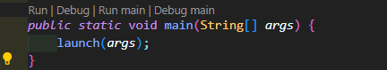

# IQ Puzzler Pro Solver

## Deskripsi Program
Program ini adalah sebuah solver untuk permainan **IQ Puzzler Pro** yang menggunakan **algoritma Brute Force** dengan teknik **rekursi dan backtracking**. Program ini memiliki fitur utama sebagai berikut:

- Memuat konfigurasi papan dan blok dari file input ".txt".
- Menyelesaikan puzzle dengan menempatkan semua blok pada papan tanpa tumpang tindih.
- Menyimpan solusi ke dalam file teks atau gambar.
- Menampilkan solusi secara visual menggunakan **antarmuka grafis (GUI)** berbasis **JavaFX**.

## Requirement Program
Berikut adalah **prasyarat** untuk menjalankan program:

- **Java Development Kit (JDK):** Versi **11 atau lebih baru**.
- **JavaFX:** Library untuk GUI.
- **File Input:** File teks berisi konfigurasi papan dan blok (*contoh tersedia di folder test/input*).
- **Sistem Operasi:** Program dapat dijalankan di **Windows atau Linux**.

## Instalasi
1. Pastikan **JDK** dan **JavaFX** sudah terinstal di sistem Anda.
2. Clone repository ini atau **download source code program**.
   ```bash
   git clone "https://github.com/varel183/Tucil1_13523008.git"
   ```
3. Jika menggunakan **IDE** (seperti **IntelliJ IDEA** atau **Eclipse**), pastikan untuk mengkonfigurasi **JavaFX SDK** di **project settings**.

## Cara Mengkompilasi Program 
1. **Buka terminal atau command prompt.**
2. **Navigasi ke direktori project.**
3. Jalankan perintah berikut untuk mengkompilasi program:
   ```bash
   javac --module-path <path-to-javafx-sdk/lib> --add-modules javafx.controls,javafx.fxml gui/App.java
   ```
   **Ganti `<path-to-javafx-sdk>` dengan path ke JavaFX SDK** di sistem Anda.

## Cara Menjalankan Program 1
Setelah program dikompilasi, jalankan dengan perintah berikut:
```bash
java --module-path <path-to-javafx-sdk/lib> --add-modules javafx.controls,javafx.fxml gui.App
```
**Langkah-langkah penggunaan:**
1. Masukkan **nama file input** (tanpa ekstensi `.txt`) di kolom *"Input file name"*.
2. Klik **"Load Puzzle File"** untuk memuat puzzle.
3. Klik **"Solve Puzzle"** untuk menjalankan solver.
4. Setelah solusi ditemukan, gunakan tombol **"Save Solution"** atau **"Save Solution to Image"** untuk menyimpan solusi ke file teks atau gambar.

## Cara Menjalankan Program 2
1. Masuk ke src/tucill1/
2. Buka src/tucill1/src/main/java/gui/App.java
3. Tekan Run



## Cara Menjalankan Program 3
1. **Buka terminal atau command prompt.**
2. **Navigasi ke direktori project.**
3. Jalankan perintah berikut untuk mengkompilasi program:
   ```bash
   java --module-path <path-to-javafx-sdk/lib> --add-modules javafx.controls,javafx.fxml -cp bin gui.App
   ```
   **Ganti `<path-to-javafx-sdk>` dengan path ke JavaFX SDK** di sistem Anda.

## Struktur File
```
src/
 ├── main/java/
 │   ├── gui/      # Kode untuk antarmuka pengguna (GUI)
 │   ├── logic/    # Kode untuk logika permainan (papan, blok, solver)
 │   ├── utils/    # Kode utilitas (input/output, manajemen warna)
 │
test/
 ├── input/        # File teks berisi konfigurasi puzzle
 ├── output/       # File teks/gambar hasil solusi
```

## Contoh File Input
File input harus memiliki format berikut:
```
N M P
CaseType
<Blok 1>
<Blok 2>
...
<Blok P>
```
### Contoh:
```
3 3 2
DEFAULT
AA
A
B
BB
```

## Author
**Program ini dibuat oleh:**

- **Nama:** Varel Tiara  
- **NIM:** 13523008  